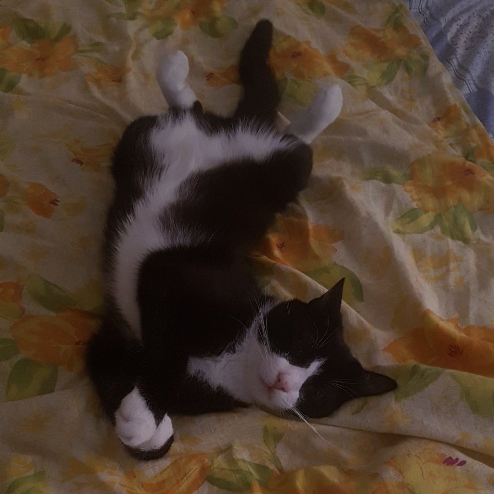

# Портфолио Антона Кузнецова
## Hello, world!
### Немного информации обо мне.
Что я умею:  
-C++(Basic level)  
-С#(Basic level)
-С(Basic level)  
-Pyhon(low Basic level)
-JavaScript(low level)
-PascalABC  
-Excel  
-Github pages  
# 2 Семестр 
### Работы по Программированию:
1. Вывод таблицы истинности для не A   

```Python  
"""
		Кузнецов Антон Денисович 
		ИВТ 1.1, 2 курс
		Задание: Вывод таблицы истинности для не A  
"""
header = "- A -- not A -"
tmpLen =  len(" not A ")
dot = "-"
A = [1, 0]
print(dot * len(header) +"\n" + header + 
     "\n" + dot * len(header))
print(dot + " " + str(A[0]) + " " + dot*2 +
	 tmpLen // 2 * " " + str(int(not A[0])) + tmpLen // 2 * " " + dot +
	 "\n" + dot * len(header) +"\n" +
	 dot + " " + str(A[1]) + " " + dot*2 +
	 tmpLen // 2 * " " + str(int(not A[1])) + tmpLen // 2 * " " + dot 
	 + "\n" + dot * len(header) +"\n")
input()  

```

2. Вычисление площади треугольника по формуле Герона

```Python  

"""
		Кузнецов Антон Денисович 
		ИВТ 1.1, 2 курс
		Задание: вычисление площади треугольника по формуле Герона
"""
import math

def geron_sq(a,b,c):
	"""
		Функция вычисляет площадь треугольника по трем сторонам.


	"""
	p = int((a + b + c) / 2)
	res = p * math.sqrt((p - a) * (p - b) * (p -c))
	return res

def main():
	"""
		Функция всех функций
		
	"""
	a = int(input("Введите сторону a:"))
	b = int(input("Введите сторону b:"))
	c = int(input("Введите сторону c:"))
	print(geron_sq(a, b, c))


main()
input()  

```
3.

# 3 СЕМЕСТР
### Веб:


1) Completed!

2) DTD.

[Тута](https://github.com/Fourwqw/AntonKuznetsov.github.io/tree/master/part2).

3) LAB.

[Тута](https://github.com/Fourwqw/AntonKuznetsov.github.io/tree/master/part2).

4) Введение.

[Тута](https://kodaktor.ru/task_18c81).

5) Функции. 

```JavaScript 

"""
const concat = require('goss_concat');
function rgb(r = 255, g = 255, b = 255) {
  return concat('rgb(', r, ',', g, ',', b, ')');
}
console.log(rgb(14, 188)); 
document.querySelector('button')
.addEventListener(
  'click',
   e => {
     const result = rgb(255,10);
     document.body.style.backgroundColor = result;
     e.target.textContent = result; 
   }
);

"""

```
6) Зависимость.

[Тута](https://kodaktor.ru/task_func_8589b).

7) Счётчик.

[Тута](https://kodaktor.ru/2c4cefb_bbbd4).

8) IIFE.

[Тута](https://kodaktor.ru/16102018_8cd7e).

9) LAB.

[Тута](https://kodaktor.ru/08fd736_140f4).

10) Async/fetch. 

[Тута](https://kodaktor.ru/13112018_04372).

# 4 СЕМЕСТР

1) HTML5 API.

[Тута](https://kodaktor.ru/be8e0d3_368bd).

[Тута](https://kodaktor.ru/custom_39cb4).

2) Canvas.

[Тута](https://kodaktor.ru/3b1c96e_a3ff8).

3) GD2. 

[Тута](https://kodaktor.ru/30_4ce74).

4) JSX React.

[Тута](https://react-ev3dxr.stackblitz.io).

[Тута](https://stackblitz.com/edit/react-ev3dxr).

### Самостоятельная работа

ИСР

1.1) Микшер. 

[Тута](https://kodaktor.ru/1dc8cc3).

1.2) Корзинка.

[Тута](https://kodaktor.ru/custom_39cb4).

2.1) Canvas.

[Тута](https://kodaktor.ru/3b1c96e_a3ff8).

2.2) Fabric.

[Тута](https://kodaktor.ru/0f1bb39_5517a).

3.1) Визуализация инфографики.

[Тута](https://kodaktor.ru/0f1bb39).

3.2) Капча.

[Тута](https://kodaktor.ru/33b25ec).

# 5 Семестр

### Ит в изучении иностранных языков:
### Задания 
1)

2)

3)

4)

5)
### Фото моего кота

#### EditWorld
##### AntonKuznetsov.github.io
